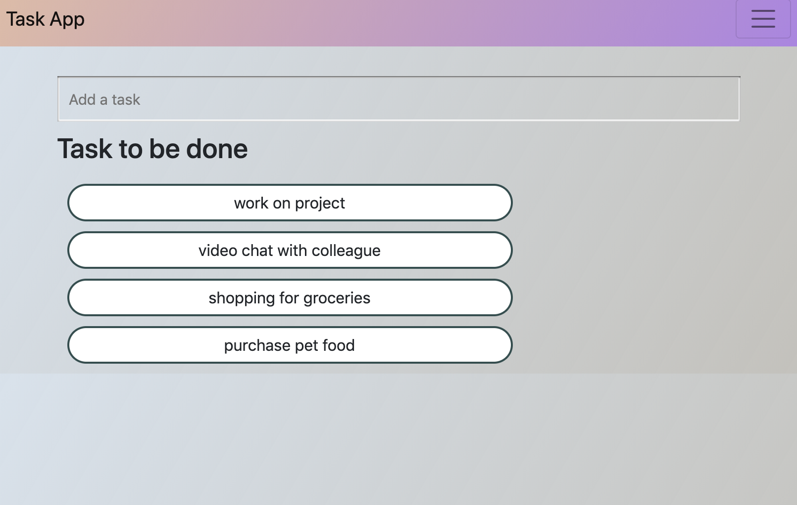
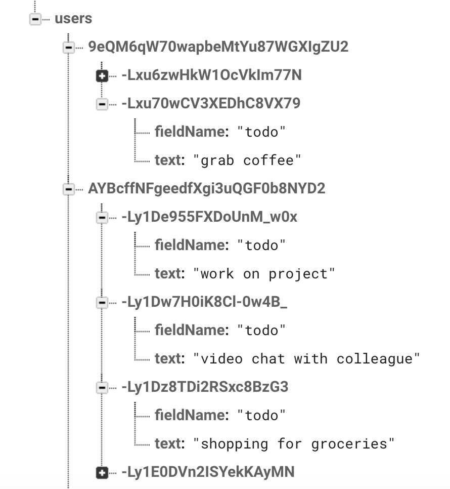
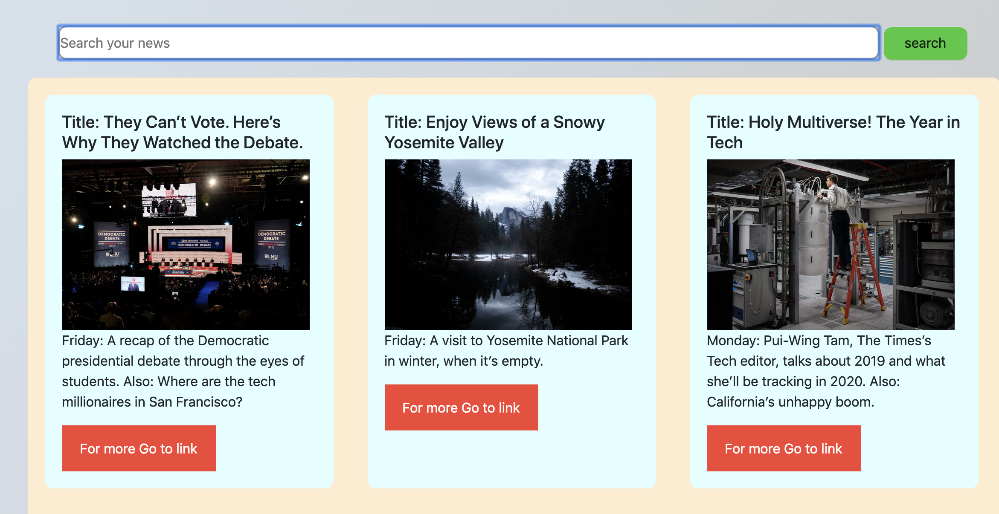
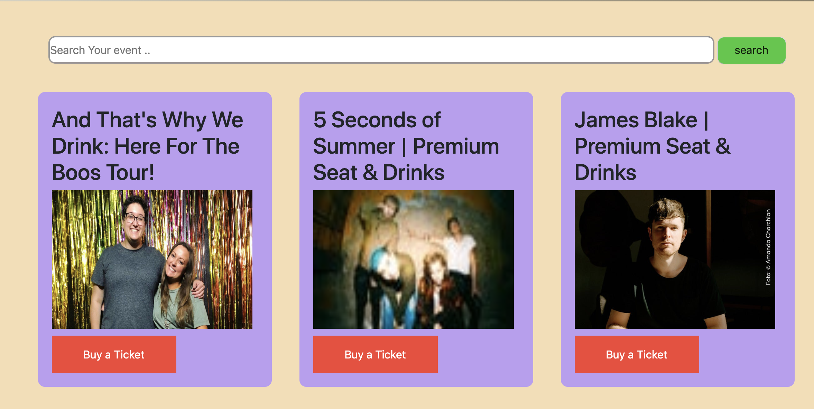
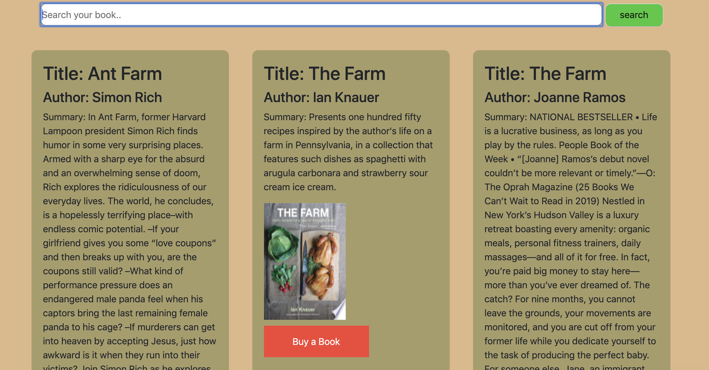

# project1 - TaskApp

TaskApp is the first project I worked on with two fellow colleagues during the bootcamp. 
We utilized firebase's simple authentication to grab the user and set a unique ID that would
be useful for the todo section of the app. In addition using the firebase authentication would allow me to add/delete any users as well as track when the account is created and last signed in.

     

Using firebase real time database and authentication I was able to automatically display the todo list that was created by the original user by using the unique ID that was given to the user when they signed up with their email. When the user adds or delete (by clicking on the task) it would update in real time on the firebase database. 

In order to delete a specific task I used the foreach childsnapshot to loop through every single task and placed an if statement to locate the task that matched the task that was clicked. 

     

The above image shows how the firebase database structure was set up. Once a user signs up the unique ID of the user would be pushed as a child under users. The child elements of the unique ID would be the unique ID of the task, field name and the text which includes the task that the user entered. 

Other features of the app includes querying for news, books, and events.

     

By using the nytimes news api users would be able to search for news articles related to the term they entered in the search bar and link is provided for the user if they want to read more about it. 

     

Users are also able to search up events by keyword. For the events we used the ticketmaster api to grab the image, description as well as purchase ticket link. 

     

For the book search we used the google books api. User is able to search for a specific book which would return the title, author, short description and a purchase link.

     

Added another feature to the project, which allows the user to see the weather conditions by searching up any cities in California. 

Deployed link : https://task-app-project.herokuapp.com/
